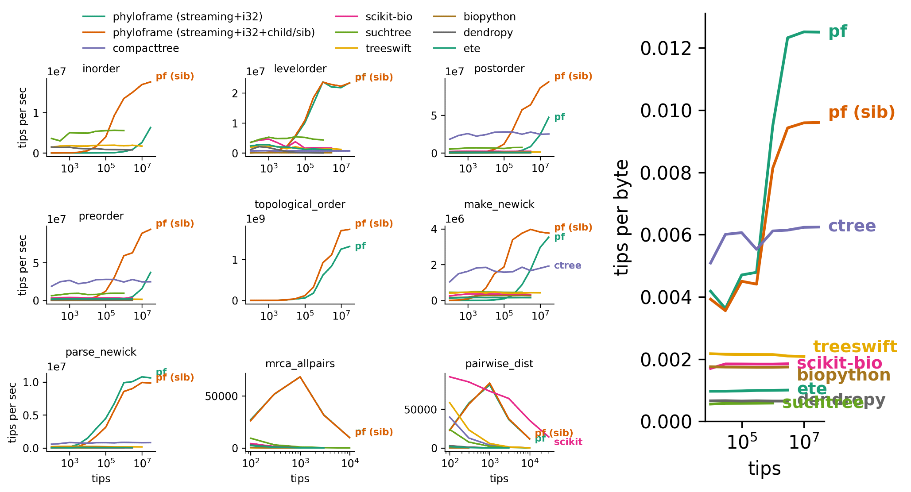
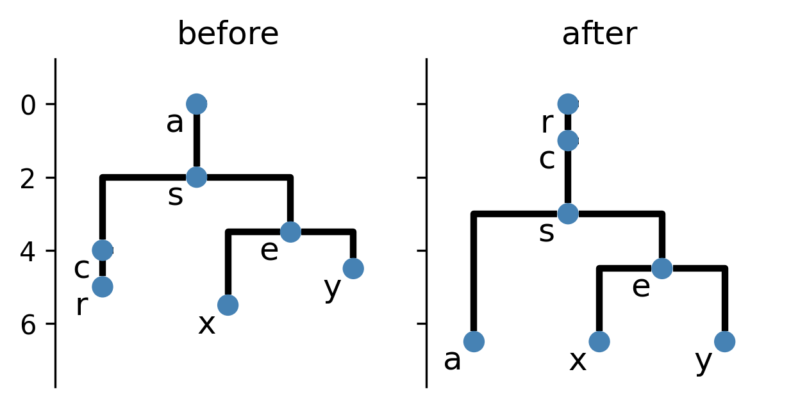
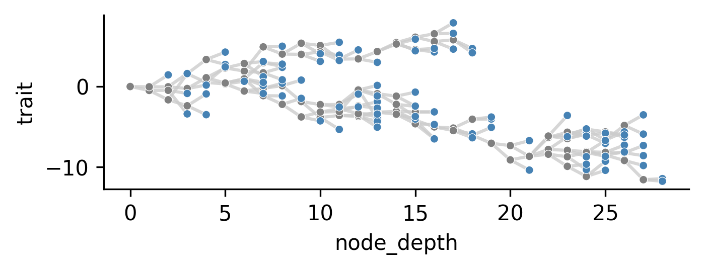

# Summary

PhyloFrame is a Python library for phylogenetic computation bridging the gap between specialist, high-performance computations and flexible, script-based workflows.
The core distinction of the library is the use of a fully DataFrame-based data structure.
Performance-critical routines are JIT-compiled via Numba [@lam2015numba], and this interface is easily available to the end-user, allowing quick prototyping in interacive, notebook based development.
For many operations at large tree sizes (e.g., $\geq$ 1 million taxa), phyloframe provides generally comparable or greater speed and memory-efficiency than implementations backed by native code.
Notably, newick reads and topological-order tree traversal (i.e., parents before children) are up to $10\times$ faster than existing tools and
Newick writes are up to $2\times$ faster.

Trees are stored in the Artificial Life Data Standard tabular format [@lalejini2019alife], where each row corresponds to a node and columns record node identifiers, ancestor relationships, branch lengths, and arbitrary user-defined attributes.
Many operations can be accomplished with DataFrame library operations.

Nonetheless, by leveraging the Python DataFrame-based infrastructure, PhyloFrame achieves performance comparable or surpassing existing libraries for large tree sizes.
As such, PhyloFrame spans an intermediate position between rich object-oriented libraries and fully compiled libraries.

PhyloFrame provides a wide variety of functions in Pandas [@mckinney2010pandas] and Polars [@vink2024polars], with particular emphasis on downsampling and CLI operations.
Supported operations tree input/output: Newick and ALife Data Standard formats
- synthetic tree generation, MRCA and patristic distance calculation, tree traversals, topology metrics, tree manipulation, and tree comparison.

tree construction, traversal, manipulation, topology metrics, and format conversion.

# Statement of Need

Recent years have seen the advent of ultra-large-scale simulations [@moreno2024trackable] capable of generating phylogenies of upwards of a billion taxa [@singhvi2025scalable], ultra high-throughput bioinformatics workflows generating reconstructions of hundreds of millions of taxa [@konno2022deep], biotechnologies for cell-lineage tracing [@mckenna2016whole;@nguyenba2019high], and an ever-growing influx of high-throughput sequence data [@stephens2015big].
These new technologies offer large-scale phylogeny data, or evolutionary histories.

Such trees offer unprecedented visibility into ecological and evolutionary processes, but far exceed the capabilities of pre-existing tools supporting scripting-friendly, interactive development workflows characteristic of the field [@moreno2024dendropy;@cock2009biopython;@huertacepas2016ete3].
Specialized operations over or to create phylogenetic trees.

This unmet need has prompted development of several performance-first libraries [@moshiri2020treeswift;@moshiri2025compacttree;@ryneches2018suchtree].

Phylogenetic analysis is integral to much of evolution research, whether conducted \textit{in vivo} or \textit{in silico} [@faithConservationEvaluationPhylogenetic1992;@STAMATAKIS2005phylogenetics;@frenchHostPhylogenyShapes2023;@kim2006discovery;@lewinsohnStatedependentEvolutionaryModels2023a;@lenski2003evolutionary;@nozoe2017inferring].

Most existing Python tree libraries represent phylogenies as pointer-linked node objects, which limits interoperability with the broader data science ecosystem and incurs per-node Python object overhead at large scale.
PhyloFrame addresses this gap by storing phylogenies as column-oriented dataframes, enabling vectorized computation, zero-copy interoperation with analytics tools, and natural integration of metadata as additional columns.

The dataframe representation also facilitates JIT compilation of inner loops via Numba, yielding competitive traversal and parsing performance while retaining Python-level expressiveness.
\autoref{fig:benchmark} compares throughput and memory efficiency across these libraries on balanced binary trees with up to 30 million tips.[^bench]

[^bench]:
  Benchmarks were conducted on GitHub action `ubuntu-24.04` runners (4-core x86/16GB memory circa May 2026), with cross-library comparisons at a given problem size all conducted in the same job.
  Data is available via the Open Science Framework at <https://osf.io/knw8x>.
  Benchmark design follows [@moshiri2025compacttree].

Most operations support both Polars and Pandas.
Most public functions are available as a CLI command, facilitating integration in shell pipelines.



For most benchmarked operations, PhyloFrame’s performance advantage at large tree sizes (around 300,000 nodes).
For smaller tree sizes, stronger performance is gained from Python bindings for native code (e.g., CompactTree, SuchTree).
Note that workloads consisting of many small trees can be conducted using a forest representation, which combines many trees into a single DataFrame.
Another performance tradeoff of PhyloFrame is that the array representation does not necessarily support the O(1) node creation and deletion of node-based representations using allocated memory.

A likely contributing advantage to PhyloFrame’s performance advantage at large tree sizes is that Python end-user code (e.g., materializing traversals) can be implemented in a compiled context via Numpy vectorized operations, the Polars query engine, or Numba compilation.
This performance benefit is a unique advantage of PhyloFrame’s array-based DataFrame representation.

# Why a DataFrame-based Tree Representation?

The R ecosystem's success with the ape data structure demonstrates the value of edge matrix tree representations [@paradis2018ape] --- PhyloFrame pushes this idea further with a fully tabular format hosted within DataFrame objects (e.g., pd.DataFrame, pl.LazyFrame, pl.DataFrame, etc.).

DataFrames are scripting-friendly and end-user extensible, enabling a composable, interoperable, high-performance ecosystem for phylogenetic analysis.

**Fast and highly portable load/save.**
Use pandas.read_csv, polars.read_parquet, R's read.table, etc. --- libraries transparently fetch from URLs, cloud providers (e.g., AWS S3, Google Cloud, etc.), and online repositories [@foster2017open;@singh2011figshare].
Contiguous allocations support fast deserialization from other sources (e.g., Newick).

**Benefit from modern tabular file formats.**
Granular deserialization of selected columns, columnar compression for efficient storage, categorical strings, and explicit column typing with first-class null representation (e.g., Parquet [@vohra2016parquet]).
Data layout optimization for fast load/save (e.g., Feather [@wickham2016feather]).

**Benefit from modern high-performance dataframe tooling.**
Memory-efficient representation, larger-than-memory streaming operations (e.g., Polars), distributed computing operations (e.g., Dask [@rocklin2015dask]), multithreaded operations (e.g., Polars), vectorized operations (e.g., NumPy), and just-in-time compilation (e.g., Numba).

**Benefit from rich dataframe tools and expressions.**
Leverage powerful querying and transformation APIs (e.g., Polars expressions, Pandas indexing), enabling flexible filtering, bulk column calculations, grouped aggregations, join/merge operations, and chained transformations directly over tree data without manual loops.

**Cache-friendly, memory-efficient, flexible data structure.**
Data occupies contiguous arrays, expediting tree creation and topological order traversals (e.g., parents before children or vice versa).
Base memory footprint is lightweight (e.g., as little as 32 bits per node), but can be dynamically augmented to expedite traversals and calculations (e.g., child linked lists via DataFrame columns for first child/next sibling indices).

**Data Structure Interoperation.**
Multi-language interoperation (e.g., possible future support for zero-copy interop between R and Python via reticulate and Arrow [@reticulate;@arrow], possible future support for zero-copy Polars DataFrames shared between Rust and Python).
Multi-library interoperation (e.g., highly-optimized or zero-copy interoperation between Polars and Pandas; Python dataframe protocol [@meurer2023python]).
Interoperation with broader Python DataFrame ecosystem [@vallat2018pingouin;@vanderplas2018altair;@waskom2021seaborn;@rapids;@skrub])

**API Integrations and Data Format Interoperation.**
For programmatic visualizations, PhyloFrame integrates with iplotx [@zanini2025iplotx] to visualize phylogenetic trees from DataFrames.
[@vanderplas2018altair;@waskom2021seaborn].
For interactive in-browser visualization of trees up to millions of nodes, an experimental fork of taxonium [@sanderson2022taxonium] is available at <https://mmore500.github.io/taxonium> that supports alife standard CSV, TSV, and Parquet files.
Compatibility with existing alife data standards ecosystem [@lalejini2019alife].

# Features

- tree input/output: Newick and ALife Data Standard formats
- synthetic tree generation: structured (e.g., comb, balanced, star) and random (e.g., edge-adding, node-adding)
- MRCA and patristic distance calculation: pairwise and all-pairs
- tree traversals: preorder, postorder, inorder, levelorder, semiorder, and topological
- topology metrics: Colless imbalance, Sackin index, and Faith's phylogenetic diversity
- tree manipulation: collapsing unifurcations, tree pruning, tree downsampling, rerooting, and ladderizing
- tree comparison: triplet/quartet distance [@sand2014tqdist] and topological isomorphism

A full API listing is included in [PhyloFrame documentation](https://phyloframe.readthedocs.io).

# Demo: Tree Manipulation Pipeline

A brief demonstration showing several tree transforms using a pipeline pattern.
Note that complex tree manipulations, including custom operations, can be succinctly performed with no raw loops or recursion.

```python
import numpy as np; from pandas import DataFrame
from phyloframe import legacy as pfl

df_raw: DataFrame = pfl.alifestd_from_newick("(((r:1)c:2,(x:2,y:1)e:1.5)s:2)a;")
df_res: DataFrame = df_raw.drop(columns=["branch_length", "origin_time_delta"],
    ).pipe(pfl.alifestd_reroot_at_id_asexual,  # reroot at node "r"
      new_root_id=df_raw.query("taxon_label == 'r'")["id"].item(),
    ).pipe(lambda df: df.assign(branch_length=np.where(  # flip rerooted lengths
      df_raw.loc[df["id"], "ancestor_id"] != df["ancestor_id"],  # where flipped
      df_raw.loc[df["ancestor_id"], "branch_length"],  # take ancestor's value
      df_raw.loc[df["id"], "branch_length"],  # ...otherwise keep own
    ))).pipe(pfl.alifestd_to_working_format,  # reassign id values
    ).pipe(pfl.alifestd_mark_lineage_cumsum_asexual,  # accumulate branch length
      mark_as="origin_time", values="branch_length",  # ...to mark origin time
    ).pipe(pfl.alifestd_sort_children_asexual, criterion="taxon_label",
    ).pipe(pfl.alifestd_to_working_format,  # reassign id values
    ).pipe(pfl.alifestd_ultrametricize, method="extend")  # align tip times
```



# Demo: End-user JIT Compilation and Tidy Plotting

```python
import numpy as np; import polars as pl; import seaborn as sns
from phyloframe import _auxlib as pfa
from phyloframe import legacy as pfl

@pfa.jit(cache=False, nopython=True)  # JIT compile via Numba
def simulate_trait(ancestor_ids: np.ndarray) -> np.ndarray:
    trait = np.zeros(ancestor_ids.size, dtype=float)
    for id_, anc_id in enumerate(ancestor_ids):
        if id_ == anc_id: continue  # exclude root
        trait[id_] = trait[anc_id] + np.random.normal()
    return trait

def plot_trait(data: pl.DataFrame) -> None:
    selectors = dict(x="node_depth", y="trait", hue="is_leaf")
    style = dict(legend=False, palette=["gray", "steelblue"], s=15)
    ax = sns.scatterplot(data, **selectors, **style)

    depth, ancestor, trait = data[["node_depth", "ancestor_id", "trait"]]
    segments = [[depth, depth[ancestor]], [trait, trait[ancestor]]]
    ax.plot(*segments, color="#CCCCCCCC", zorder=-2)  # link parent/child

pfl.alifestd_make_edge_split_polars(n_leaves=100, seed=42,  # random tree
    ).pipe(pfl.alifestd_topological_sort_polars,  # parents before children
    ).pipe(pfl.alifestd_assign_contiguous_ids_polars,  # reassign ids
    ).pipe(pfl.alifestd_mark_node_depth_polars,  # add node_depth col
    ).pipe(pfl.alifestd_mark_leaves_polars,  # add is_leaf col
    ).with_columns(trait=pl.col("ancestor_id").map_batches(  # add trait col
        lambda x: simulate_trait(x.to_numpy()), return_dtype=float,
    )).pipe(plot_trait)  # draw tree
```




# Demo: Compound Downsampling via Command-Line Interface

[@moreno2024joinem]

```bash
ls -1 "input.csv" `# input path, in alife standard format` \
| singularity exec docker://ghcr.io/mmore500/phyloframe:v0.9.0 `# container` \
  python3 -m phyloframe.legacy._alifestd_pipe_unary_ops `# apply ops in turn` \
  --op "lambda df: pfl.alifestd_mark_sample_tips_canopy_asexual(" \
                         "df, n_sample=5, mark_as='keep_canopy')" \
  --op "lambda df: pfl.alifestd_mark_sample_tips_lineage_asexual(" \
                         "df, n_sample=5, mark_as='keep_lineage')" \
  --op "lambda df: df.assign(extant=df['keep_canopy'] | df['keep_lineage'])" \
  --op "pfl.alifestd_prune_extinct_lineages_asexual" \
  "output.parquet"  # output path
```

# Related Software

Several established Python libraries provide phylogenetic tree functionality.

- TreeSwift [@moshiri2020treeswift] is a high-performance library using compact linked-node structures, designed to scale to very large trees.
- DendroPy [@moreno2024dendropy] offers a comprehensive object-oriented framework for phylogenetic simulation and analysis.
- Biopython [@cock2009biopython] includes a `Bio.Phylo` module supporting multiple tree formats with a focus on interoperability.
- ETE [@huertacepas2016ete3] combines tree analysis with visualization capabilities.
- CompactTree [@moshiri2025compacttree] achieves minimal memory footprint through a header-only C++ implementation with a Python wrapper.
- scikit-bio [@aton2026scikitbio] provides a broad bioinformatics toolkit including tree data structures and ecological diversity analyses.
- SuchTree [@ryneches2018suchtree] uses a Cython-based array data structure, focusing on fast pairwise distance queries and co-phylogenetic analyses; operations release the Python GIL (Global Interpreter Lock) to allow multithread parallelism.
- ToyTree [@eaton2019toytree] is an object-oriented phylogeny, focusing on integrated visualization functionality.
- PhyloTrack [@dolson2024phylotrack] focuses on tree representations for recording lineage histories in agent-based models of evolution, with suppoort for on-the-fly extinction pruning and metric calculations.

In the Julia [@bezanson2017julia] ecosystem, PhyloNetworks [@solislemus2017phylonetworks] provides a comprehensive framework for phylogenetic network analysis.

The R ecosystem has largely coalesced around ape as a shared data structure [@paradis2018ape].

Another approach for working with large-scale phylogeny data is a graph database [@loureno2024phylodb].

All of these libraries represent trees as pointer-linked node objects.
PhyloFrame takes a fundamentally different approach by storing trees as column-oriented dataframes.
This design enables direct integration with pandas and Polars analytics workflows, vectorized computation over node attributes, and natural attachment of per-node metadata as additional columns without custom data structures.

Besides the common name, the PhyloFrame library presented here is unrelated to the recent machine learning methodology to counteract ancestral bias in precision medicine [@smith2025equitable].

# Projects Using the Software

PhyloFrame originated from phylogeny-tracking components developed for the hstrat library [@moreno2022hstrat], which enables phylogenetic inference over distributed digital evolution populations.
The alifestd operations now in PhyloFrame provide the core tree analysis and manipulation layer used by `hstrat` and downstream digital evolution experiments.
Underlying software (earlier, a submodule of [@moreno2022hstrat]) has contributed substantially to several projects [@moreno2025ecology;@singhvi2025scalable;@moreno2025testing;@moreno2024trackable;@moreno2022hereditary].

# Development Roadmap

Much future work remains in development of the PhyloFrame library.
cache contiguous id and topologicla order checks,, or explicitly eschew them, would benefit the library.
The legacy module (from phyloframe import legacy) provides all current phyloframe operations. The legacy API is stable and will continue to be maintained for backward compatibility.
A redesigned API will accompany phyloframe v1.0.0.

Known limitations iwth the current API include lack of automatic cleanup of generated columns after mutable operations, potentially creating out-of-date data.
It would ideally be good to have standardized column naming schemes for additional topological and structural columns, and a way for users to define their own columns as topologically or chronologically sensitive.

Rootedness and, while the alife standard does support reticulated networks, that is in a cold format (serialized strings) rather than readily parseable/manipulable encoding.

Pandas code is more permissive, whereas the Polars code generally enforces topological sortedness and contiguous IDs.
Decciding a canonical representation for trees remains for future work.
And having a way to cache whether a particuular dataframe is in that format.

Using CuPy or RAPIDS-backed data structures for GPU-based computations.

Systematic naming and organization scheme, as well as standardized keyword argument naming will also benefit the v1.0 release.

With respect to JIT compilation, it is possible to pre-compile and distribute wheels for the library based on Numba, which could further aid efficiency.

Additional specific features such as tree metrics and mannipulations, will be implemented on an as-needed basis, and feature requests via GitHub issues arewelcome.

Visualization tools, likely wrapping iplotx in combination with e.g., seaborn could also be useful.

Such approaches are not limited or specific to Python, and a number of languages havestrong DtaFrame infrastructure.
Julia, which hosts a rich tightly-integrated DataFrame infrastructure [@bouchetvalat2023dataframesjl], and where JIT compilation is a first-class language feature rather than a third-party extension [@bezanson2018julia].

It would be good to have full feature parity between Pandas and Polars, with a more ergonomic, systematic, annd symmetrical API for working with both.

# Acknowledgements

This material is based upon work supported by the Eric and Wendy Schmidt AI in Science Postdoctoral Fellowship, a Schmidt Sciences program.
This material is based upon work supported by the U.S. Department of Energy, Office of Science, Office of Advanced Scientific Computing Research (ASCR), under Award Number DE-SC0025634.
This report was prepared as an account of work sponsored by an agency of the United States Government.
Neither the United States Government nor any agency thereof, nor any of their employees, makes any warranty, express or implied, or assumes any legal liability or responsibility for the accuracy, completeness, or usefulness of any information, apparatus, product, or process disclosed, or represents that its use would not infringe privately owned rights.
Reference herein to any specific commercial product, process, or service by trade name, trademark, manufacturer, or otherwise does not necessarily constitute or imply its endorsement, recommendation, or favoring by the United States Government or any agency thereof.
The views and opinions of authors expressed herein do not necessarily state or reflect those of the United States Government or any agency thereof.

**AI Use Declaration:**
During the preparation of this work, AI tools were used to assemble manuscript boilerplate and draft benchmarking scripts.
Closely supervised agentic software development is used for refactoring code, drafting documentation, and scoped library feature development.
Such contributions are tracked via commit co-authorship.
Tools used include Claude Code, Google Gemini, and OpenAI ChatGPT.

# References

<div id="refs"></div>

\pagebreak
\appendix
